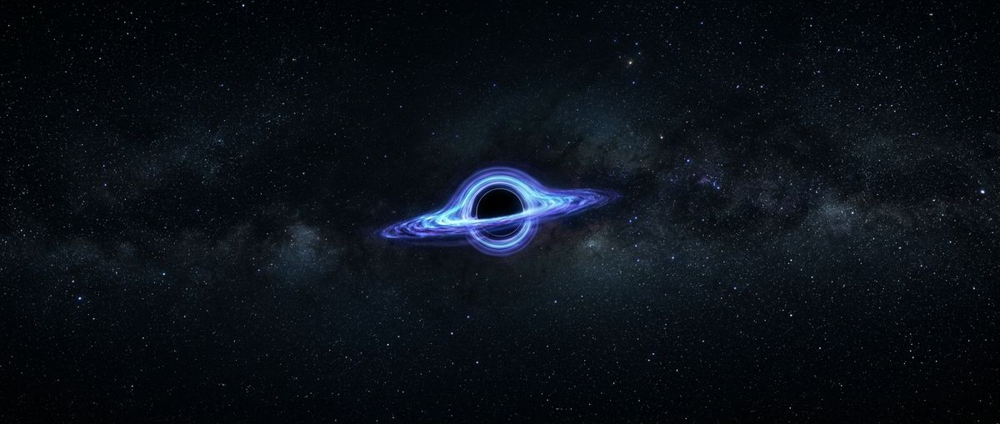

# Singularity

An experimental, single-scene 3D website built around a living black hole. No product,
no copy to sell — one continuous fall from deep space to the event horizon, driven by
scroll, disturbed by the pointer.



## Run it

```bash
npm install
npm run dev        # http://localhost:5173
npm run build      # -> dist/
npm run preview    # serve the production build
```

Deploys to Vercel or Netlify with zero configuration: both detect Vite and run `npm run build`.

### GitHub Pages

The workflow in `.github/workflows/deploy-pages.yml` builds the site and publishes `dist/` on
every push. Its first step switches the repository's Pages source to **GitHub Actions** through
the REST API if it is still on "Deploy from a branch"; if the token is not allowed to, it fails
with the manual fix (Settings → Pages → Build and deployment → Source: GitHub Actions).

"Deploy from a branch" must not be used: it serves the raw source tree, whose `index.html`
points at `/src/main.jsx`, so nothing runs and the browser shows its default dark canvas.
Project pages live under `/<repo>/`, which is why the workflow sets `VITE_BASE=/<repo>/`
before building; all asset URLs go through `import.meta.env.BASE_URL` (see
`src/utils/assets.js`). Pages caches `index.html` for up to ten minutes, so hard-refresh after
a deploy. To build for a sub-path locally:

```bash
VITE_BASE=/Black-Hole/ npm run build && npm run preview   # http://localhost:4173/Black-Hole/
```

## The experience

1. **Enter.** A ring of particles fills with load progress and waits for a click (which also lets the sound start). The ring collapses into a black core.
2. **Arrive.** Stars streak, the lens opens wide and eases in, a flash, and the black hole *forms*: the horizon grows in, the disk ignites from its inner edge outward, loose matter is captured into orbit, and a shockwave of distortion rolls across the frame. The title assembles letter by letter.
3. **Fall.** Scroll drives the camera down a spline toward the horizon, banking into turns and shivering near the end. Drag with the mouse to orbit. Chapters of text scrub in and out.
4. **Jump.** Ten real objects (Sirius, Vega, Betelgeuse, Rigel, Proxima, Polaris, Albireo, the Crab Pulsar, the Orion Nebula, Andromeda) hang on a shell far outside. Hover one, or pick it from the catalog on the right, and click: electric arcs close in from the frame edges, a velocity readout climbs to 88, the view surges forward with streaks, a white flash, and you are there. Plasma trails race ahead, sparks fall, frost creeps in at the edges and melts. A card gives the real designation, type, class and distance. Scroll, Escape or "return to the fall" jumps you back the same way; clicking another star hops directly.

## What's in the scene

| Piece | Where | Notes |
| --- | --- | --- |
| Event horizon | `src/components/canvas/BlackHole.jsx`, `src/shaders/blackHole.*.glsl` | Pure black sphere with a thin Fresnel rim. |
| Accretion disk | same, `src/shaders/accretionDisk.*.glsl` | Five stacked HDR sheets lifted off the plane so the disk has thickness. Keplerian differential rotation shears seamless polar noise into filaments; relativistic beaming brightens the approaching side. Spins up briefly on fast scrolls. `uForm` drives the ignition front during the opening. |
| Polar jets | same, `src/shaders/jets.*.glsl` | Two faint plasma columns on open cylinders along the spin axis, flowing outward. |
| Warp / time-jump pass | `src/components/canvas/WarpEffect.jsx`, `src/shaders/warp.frag.glsl` | Radial streaks toward the travel target, an electric rim while charging, a white-out, and frost that creeps in from the edges. Gated on its uniforms so an idle frame costs one texture read. |
| Directors | `src/directors/intro.js`, `src/directors/jump.js` | GSAP timelines that drive the shared `sim` object: the arrival sequence and the time-jump (charge, flash, teleport, aftermath). |
| Camera-space effects | `src/components/canvas/CameraFX.jsx`, `src/components/ui/JumpArcs.jsx` | Trails and sparks live in the camera's frame inside the scene; the lightning is a 2D canvas above the post stack so streaks never smear it. |
| Distant objects | `src/stars.js`, `src/components/canvas/DistantStars.jsx` | Real catalog data. Sprites with hover labels and generous hit spheres; the pulsar sweeps two beams, the binary orbits, the nebula is layered gas, the galaxy is a spiral shader. |
| Nebulae | `src/components/canvas/Nebulae.jsx` | Four faint fbm billboards far out, for depth. |
| Gravitational lensing | `src/components/canvas/LensingEffect.jsx`, `src/shaders/lensing.frag.glsl` | Custom `postprocessing` effect. A softened point-mass lens equation warps the whole frame around the projected singularity, so the far side of the disk folds over and under the shadow and the shadow comes out ~1.6× the geometric sphere. Per-channel dispersion grows toward the edge; a small twist fakes frame dragging; a photon ring sits on the solved shadow edge. |
| Particle field | `src/components/canvas/ParticleField.jsx`, `src/shaders/particles.*.glsl` | One `Points` draw call. Half are distant stars on a shell, half are matter that orbits, spirals in faster as it nears the horizon, and respawns. Positions are computed on the GPU from a per-particle seed. The pointer is a soft push-and-swirl field. |
| Camera | `src/components/canvas/CameraRig.jsx`, `src/utils/poses.js` | One owner with modes: intro (warp arrival), fall (spline, drag-orbit, banking, shiver near the horizon), jump (charge-up surge), star (parked, slow drift). Pointer parallax on top. |
| Post stack | `src/components/canvas/PostFX.jsx` | lensing → bloom → film grain (from the scanned grain texture) → vignette → ACES. Lazy-loaded as its own chunk. |
| HUD | `src/components/ui/HUD.jsx`, `src/content.js` | GSAP ScrollTrigger timeline scrubbed across the page. Live readouts (distance in horizon radii, descent %) are written straight to the DOM. All copy lives in `content.js`. |
| Loader | `src/components/ui/Loader.jsx` | A ring of particles fills with load progress, then spirals into a black core before handing over. |
| Audio | `src/utils/audio.js` | Synthesised drone plus cues (swell, whine + crackle, boom, ping), no files. Starts on the enter click, mute toggle bottom-right, remembered in `localStorage`. |
| Catalog + card | `src/components/ui/Catalog.jsx`, `src/components/ui/StarCard.jsx` | Keyboard-reachable list of the objects; the readout card with a counting distance; the "88 mph" velocity overlay. |

## Performance & accessibility

- Device tier from `hardwareConcurrency` / `deviceMemory` / touch sets particle count (3.5k–16k) and DPR cap (`src/utils/deviceTier.js`).
- `prefers-reduced-motion`: fixed camera vantage, no drift, static particles, half the particle budget, no scroll lift on text.
- No WebGL: the generated approach shot plays as a video behind the same words (poster only under reduced motion).
- Keyboard: a "skip to credits" link is first in the tab order; focusing any credits link scrolls the credits into view. The 3D canvas is `aria-hidden`.

## Assets

`public/textures/` — equirectangular starfield, scanned grain tile, soft particle sprite, HUD grid.
`public/media/` — `approach.mp4` (8 s dolly toward the black hole, 720p), its poster, and the OG image.

## Debugging

The zustand store is exposed as `window.__scene` (`getState()` shows phase, scroll progress, camera distance, active star, tier) and the per-frame simulation object as `window.__sim` (formation, warp, flash, frost, camera mode).
